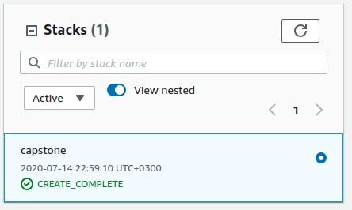
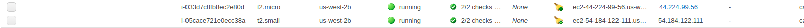
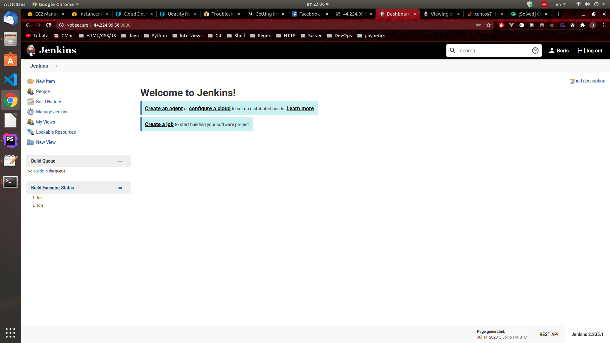

# Udacity DevOps Capstone Project
This project is the capstone of the Cloud DevOps Nanodegree. In it I had to deploy an app using CloudFormation, Jenkins and Kubernetes.
## Setup
1. I chose the rolling deployment type and chose to use a basic index.html for the actual deploy.
2. The first step is to create the actual CloudFormation stack. After cloning the repo, create the stack (The cluster takes about 10 mins to create. Please not that the SSHLocation in this case is my own IP address, please change it with you corresponding local IP address):
    - `cd aws-cloudform`
    - `./create.sh capstone network.yaml network-params.json`

3. After creating the cluster we should see the CREATE_COMPLETE message as well as the new EC2 instances created.
    - 
    - 
4. The t2.micro instance is the jenkins node, and the t2.small is the worker node used in our rolling deployment.
5. The user-data from our cloudformation script should have installed all the necessary packages for our jenkins node, and we should login by using the instance's IPv4 Public IP
with an added :8080 to login in Jenkins. After the inital set-up you should see the Jenkins dashboard (If you cant login to Jenkins, connect to the Jenkins instance via SSH and start running the commands from the network.yaml file -> JenkinsInstance: UserData):
    - 
6. Now we need to `scp` the kubernetes folder to our jenkins instance so that we can then deploy to kubernetes.
6. Now we move on to creating the actual pipeline:
    - erronous pipeline: